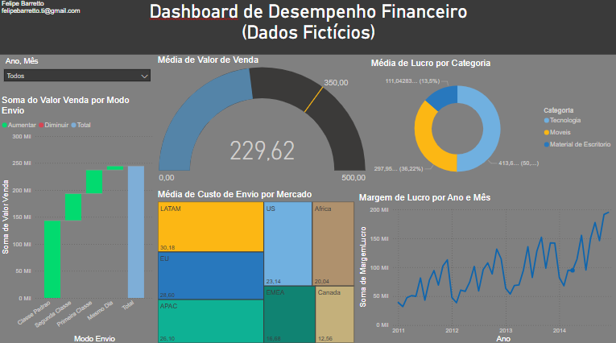

# EN #

# 📊 Financial Performance Dashboard

This repository contains an interactive dashboard created in Power BI for financial performance analysis, using dummy data. 
The goal is to visualize metrics such as sales value, shipping cost, profit margin, and more.

## 📷 Screenshot

## 🚀 Features

✅ Analysis of average sales value
✅ Comparison of profit margin over time
✅ Calculation of shipping cost per market
✅ Dynamic filtering by year and month

## 🛠 Technologies Used

Power BI – Dashboard creation

## 📂 How to Use
1. Download the `.pbix` file from this repository;
2. Open it in Power BI Desktop to explore the report.
3. Explore the interactive charts and filters.

## 📝 Notes

The data used in this project is fictional and created for educational purposes.

# PT-BR #

# 📊 Dashboard de Desempenho Financeiro  

Este repositório contém um **dashboard interativo** criado no **Power BI** para análise de desempenho financeiro, usando **dados fictícios**.
O objetivo é visualizar métricas como **valor de venda, custo de envio, margem de lucro** e mais.  

## 🚀 Funcionalidades  
✅ Análise da **média de valor de venda**  
✅ Comparação da **margem de lucro** ao longo do tempo  
✅ Cálculo do **custo de envio por mercado**  
✅ Filtro dinâmico por **ano e mês**  

## 🛠 Tecnologias Usadas  
- **Power BI** – Construção do dashboard  

## 📂 Como Usar  
1. Faça o download do arquivo `.pbix`;
2. Abra no Power BI Desktop.
3. Explore os gráficos e filtros interativos

## 📝 Notas
Os dados usados neste projeto são fictícios e foram criados para fins educacionais.

## 📬 Contact

📧 Email: felipebarretto.ti@gmail.com 🔗 [LinkedIn](https://www.linkedin.com/in/felipe-barretto-990054304/)
